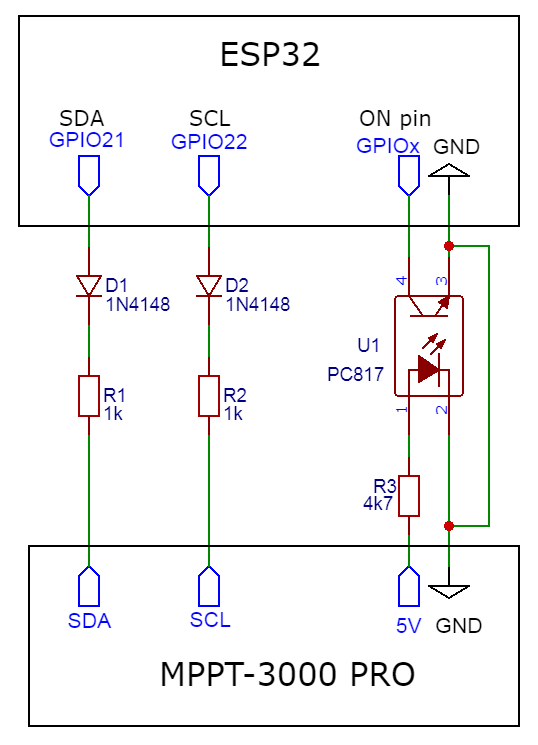
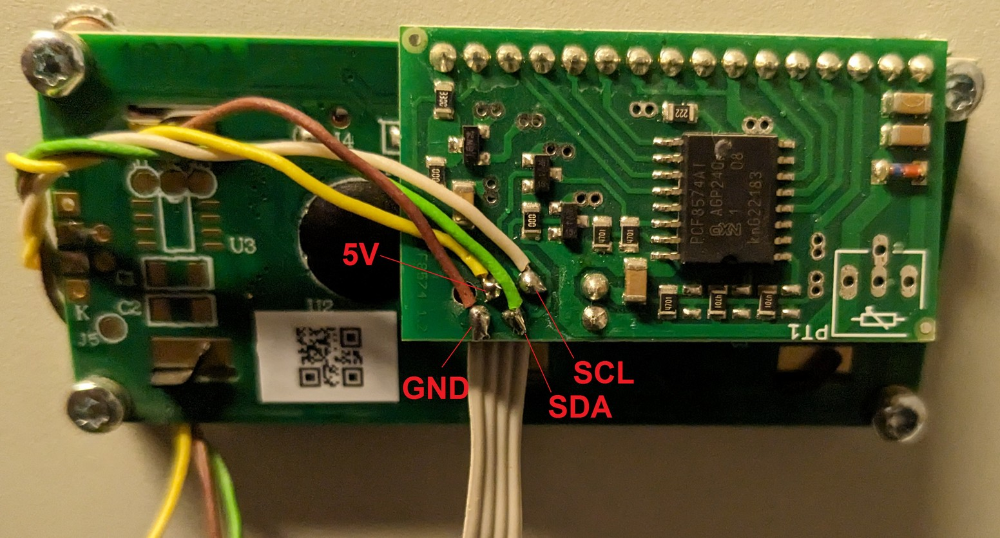

# ECO Solar Boost MPPT-3000 PRO ESPHome External Component

This repository contains a component for [ESPHome](https://esphome.io/)
to support the AZO Digital ECO Solar Boost MPPT-3000 PRO inverter.

ESP32 acts as I2C bus sniffer and decodes messages displayed on inverter LCD. Tested with inverter version 5.49.

## Usage
Connect ESP32 to LCD module side of the inverter.
 - GND to GND
 - SDA data pin to configured GPIO, default 21
 - SCL data pin to configured GPIO, default 22
 - use 1K series resistor with diode or high speed opto coupler to connect data pins (e.g. 2ch VO0631T, 2x 1ch 6N137-L)
 - Use external power supply for ESP32, inverter does not provide enough 5V power
 - Additional optocoupler connected to 5V supply may be used to detect if inverter is on, `binary_sensor gpio`

File `mppt3000.yaml` contains example ESPHome configuration.
 - Component is not compatible with regular `i2c` bus configuration
 - Default `update_interval` is 60 seconds as inverter reports all values every +/-20 seconds, median from last 3 values is used to filter out missed characters
 - Timeout filter is recommended for non incremental values
 - Data aquisition may get stuck, node may be rebooted using configured restart switch
 - Either use github link or copy `components` files to `esphome` local storage and set `- source: components`

## Configuration variables:
 - **voltage** (Optional): PV string voltage
    - All options from [Sensor](https://esphome.io/components/sensor/#config-sensor).
 - **current** (Optional): PV string current
    - All options from [Sensor](https://esphome.io/components/sensor/#config-sensor).
  - **power** (Optional): PV string power production
    - All options from [Sensor](https://esphome.io/components/sensor/#config-sensor).
  - **energy_day** (Optional): Energy produced since power up/morning
    - All options from [Sensor](https://esphome.io/components/sensor/#config-sensor).
  - **energy_total** (Optional): Energy produced since manufacturing
    - All options from [Sensor](https://esphome.io/components/sensor/#config-sensor).
  - **output** (Optional): Active output, 1 or 2
    - All options from [Sensor](https://esphome.io/components/sensor/#config-sensor).
  - **on_state** (Optional): Inverter is powered on, 5V is present
    - All options from [Binary Sensor](https://esphome.io/components/binary_sensor/#config-sensor).
  - **no_data_count** (Optional): Count of consecutive intervals no valid data was read. Useful for debuging or forced reset configuration.
    - All options from [Sensor](https://esphome.io/components/sensor/#config-sensor).
  - **on_pin** (Optional, [Pin](https://esphome.io/guides/configuration-types#config-pin)): The pin for detecting presence of 5V from inverter. Usually needs to be inverted if optocoupler is used. Pin is also used internally to reset I²C bus in case no data were read in over 10 intervals and 5V is present.
  - **sda** (Optional, [Pin](https://esphome.io/guides/configuration-types#config-pin)): The pin for the data line of the I²C bus. Defaults to GPIO21 for ESP32.
  - **scl** (Optional, [Pin](https://esphome.io/guides/configuration-types#config-pin)): The pin for the clock line of the I²C bus. Defaults to GPIO22 for ESP32.
  - **address** (Optional, int): Manually specify the I²C address of PCF8574A. Defaults to 0x3F. Another address can be 0x27.
  - **update_interval** (Optional, [Time](https://esphome.io/guides/configuration-types#config-time)): The interval to check the sensor. Defaults to 60s.

## LCD board PCF8574A pin mapping to HD44780
LCD driver is controlled in 4-bit mode via I2C expander. Inverter is expecting PCF8574 address 0x27 or PCF8574A address 0x3F.
 - P0 - RS
 - P1 - R/W
 - P2 - E
 - P3 - not connected, always High
 - P4 - DB4
 - P5 - DB5
 - P6 - DB6
 - P7 - DB7

## Grafana

