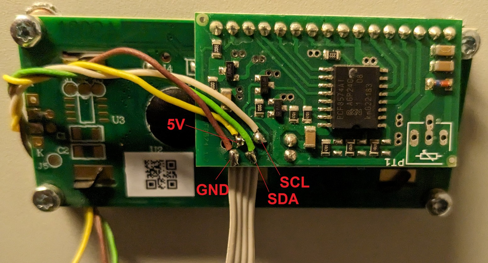

# ECO Solar Boost MPPT-3000 PRO ESPHome External Component

Repozitář obsahuje [ESPHome](https://esphome.io/) komponentu pro AZO Digital ECO Solar Boost MPPT-3000 PRO invertor.

ESP32 naslouchá na I2C sběrnici a dekóduje obsaho zobrazený na displeji. Otestováno s verzí invertoru 5.49.

## Použití
ESP32 module se připojí na LCD modul invertoru.
 - GND na GND
 - SDA pin na nakonfigurovaný GPIO pin, default 21
 - SCL pin na nakonfigurovaný GPIO pin, default 22
 - datové piny musí být připojeny přes 1K rezistor nebo digitální optočlen (např. 2 kanálový VO0631T, 2x 1 kanálový 6N137-L)
 - ESP32 nelze napájet z 5V invertoru, neposkytuje dostatečný proud
 - zapnutý invertor lze detekovat optočlenem připojeným na 5V napájení LCD, přidat do konfigurace `binary_sensor gpio`

Soubor `mppt3000.yaml` obsahuje vzorovou konfiguraci ESPHome.
 - výchozí `update_interval` je 30 sekund, jelikož invertor zobrazuje veškerá data zhruba každých 20 sekund
 - je doporučeno nastavit timeout filter na neinkrementalní veličiny
 - odposlech se občas může zaseknout, ESP32 lze vzdáleně nebo automatizovaně restartovat nakonfigurovanou komponentou restart switch
 - v konfiguraci lze využít odkaz na Github nebo zkopírovat adresář `components` do úložiště ESPHome a nastavit `- source: components`
